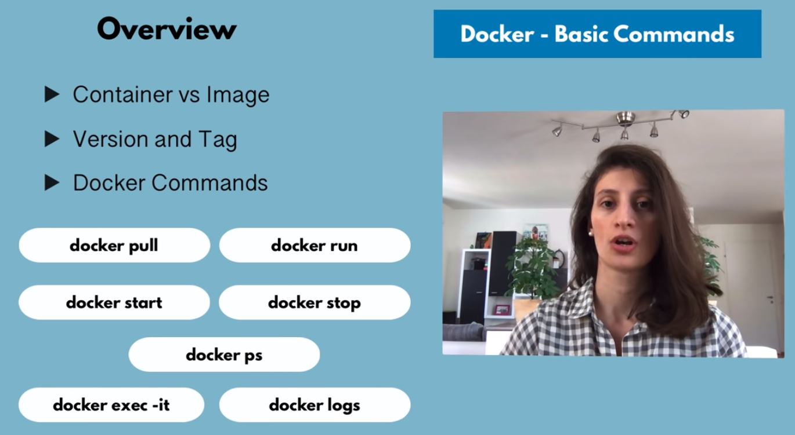

## Basic docker commands:

- `docker run image:version` -> this cmd downloads the the image.
- `docker run -d` -> run in *detached* mode, so we can use terminal again.
- `docker run -p6000:6379` -> bind *container* port to *host* post.
- `docker run --name redis-older redis:4.0` -> will create a new container, named as `redis-older`
- `docker images` -> to see all the images that we've locally.
- `docker ps` -> to see the running containers.
- `docker ps -a` -> to see all containers (both running and turned off).
- `docker start container_id`
- `docker stop container_id`
 

### Docker commands

---

## **Container** port vs **Host** port:

- `docker run -p6000:6379 redis`
    - here `6000` is **host port**.
    - here `6379` is **container port**.
    - `redis` is the *image* name that will be pulled from docker hub.

---

## Debugging a container:
57 mins 15 sec

- `docker logs container_name`
- `docker logs container_id`
- `docker exec -it container_id /bin/bash` (clearly bujhi nai)
- `docker exec -it container_name /bin/bash` (clearly bujhi nai)

