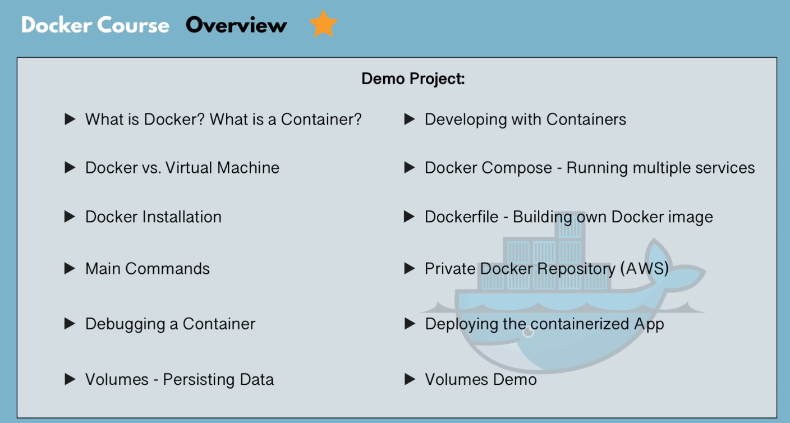
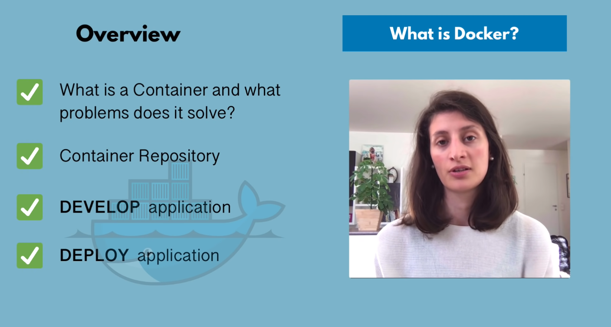
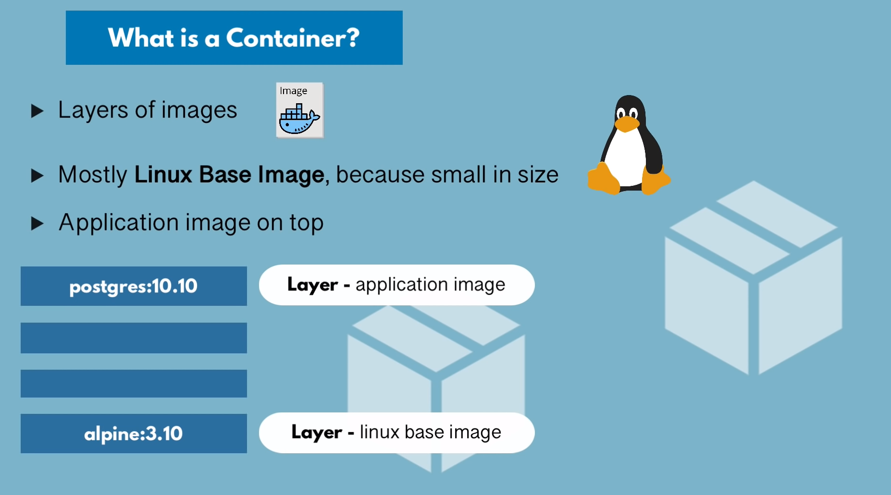
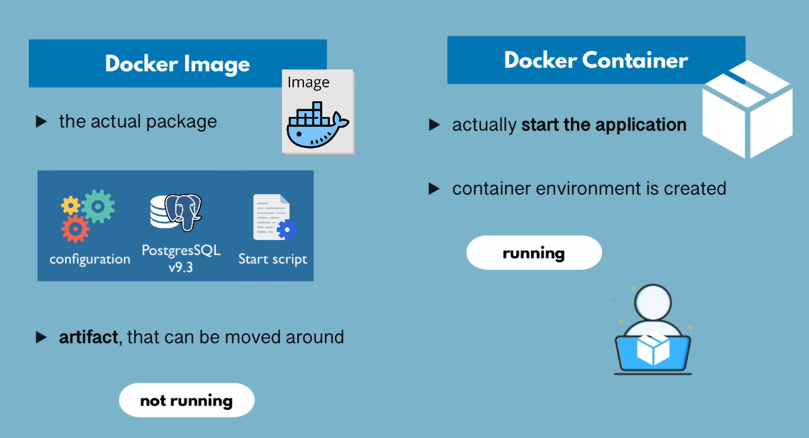
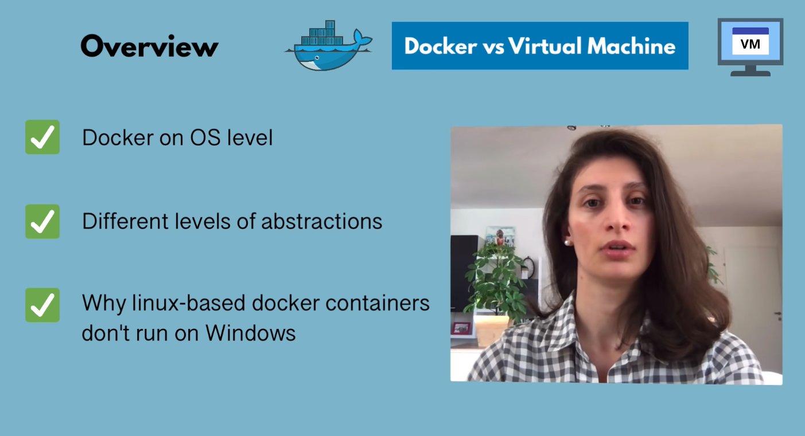
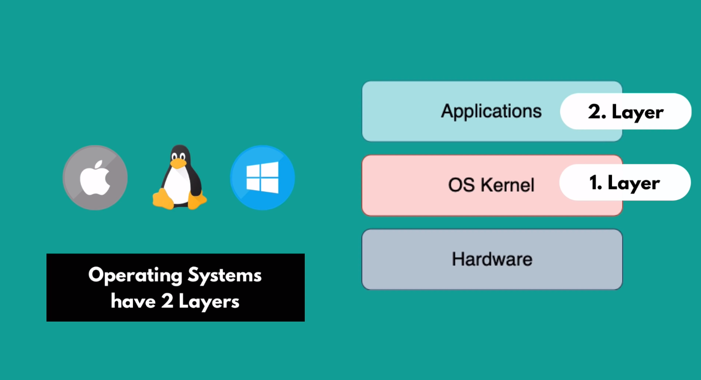
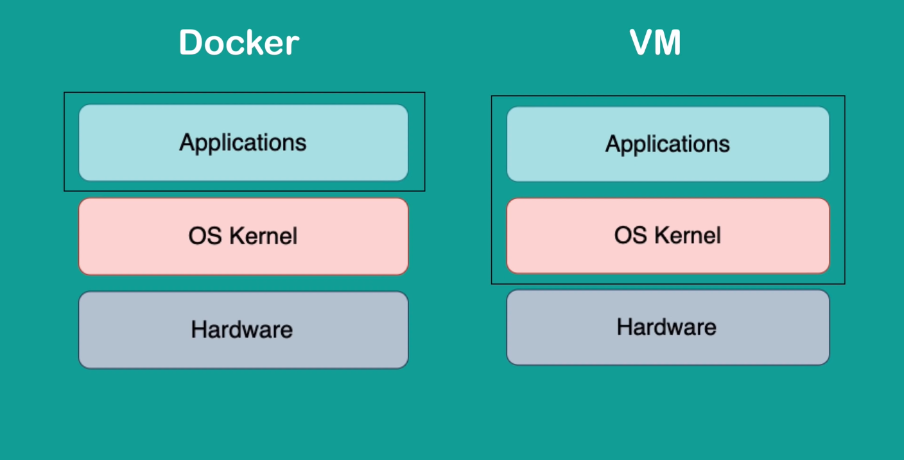

## Course Overview:

---

## What is Docker:

---
## What is a Container:

---
## Docker *Image* vs *Container* :

---

## *Docker* vs *Virtual Machine* :

---

- OS has 2 layers:
    1. *OS Kernel Layer* : It communicates with hardware.
    1. *Application Layer* : All applications run on **kernel** layer.

---

- Differences between docker and VM:
    1. *Size* : Docker image is much smaller.
    1. *Speed* : Docker containers start and run much fast.
    1. *Compatibility* : VM of any OS can run on any OS host.

---
